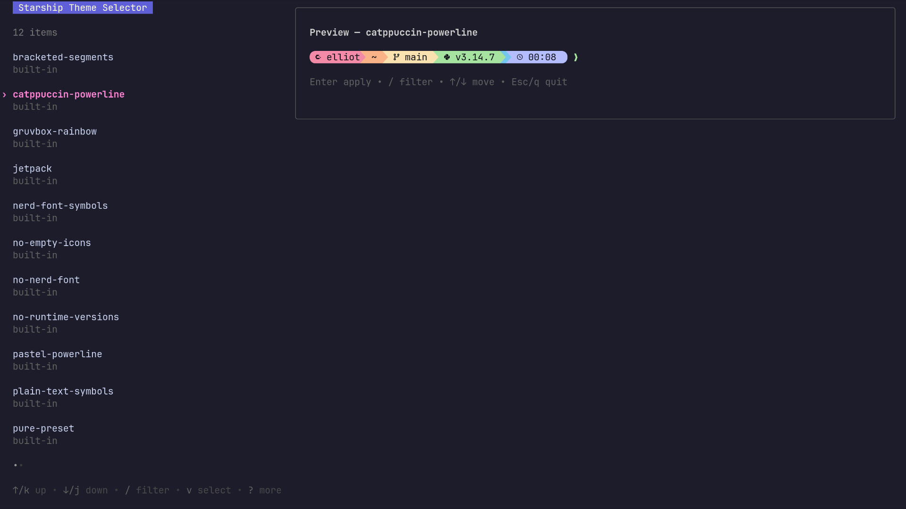

# Starship Theme Selector

A Starship theme picker with live preview.



## Requirements

[Starship](https://starship.rs/) must be installed and available as `starship` in `PATH`.

## Install

```sh
mise use -g github:Elliot-32/starship-theme-selector
```

Or with Go:

```sh
go install github.com/Elliot-32/starship-theme-selector/cmd/ssts@latest
```

## Usage

```sh
# Pick a theme interactively
ssts

# Apply a theme directly
ssts tokyo-night

# List available themes
ssts list
```

## Custom themes

Put custom Starship configs in:

```text
~/.config/ssts/themes/*.toml
```

The filename becomes the theme name. For example:

```text
~/.config/ssts/themes/my-theme.toml
```

can be applied with:

```sh
ssts my-theme
```

Custom themes take precedence over built-in presets with the same name.

## Shell completion

Generate completion with:

```sh
ssts completion zsh        # or bash, fish, powershell, nushell
```

For mise-completions-sync:

```toml
ssts = { provided_by = "starship-theme-selector", zsh = "ssts completion zsh", bash = "ssts completion bash", fish = "ssts completion fish" }
```
